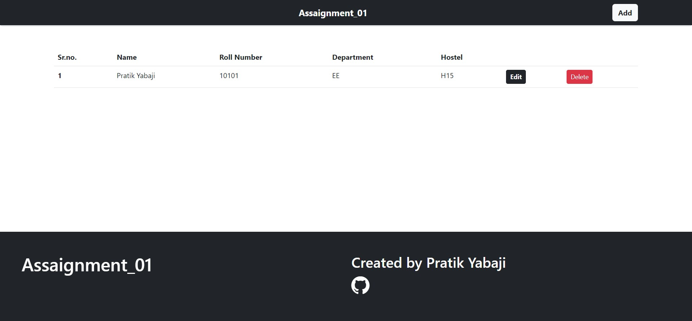

# UGAC Web Convener Assaignment



## Author

- [@Pratik Yabaji](https://pratik-yabaji.github.io/Portfolio-Website/)


## 🔗 Links
[]( https://pratik-yabaji.github.io/Portfolio-Website/)
[](https://www.linkedin.com/in/pratik-yabaji-915123231)


## Installation

Install my-project with git

```bash
  git clone https://github.com/Pratik-Yabaji/Assaignment-01-React.git
```
Now, put the file in htdocs file of your local server.

Creat a new database named 'assaignment_01_db', with the help of phpMyAdmin.

Creat table named 'students' in the database.
The table should consists of five columns

1. Sr.no. - Primary key ON
2. name - For Students name
3. roll_number - For students Roll_number
4. department - For students department
5. hostel -For students hostel
    
## Acknowledgements

 - [Bootstrap](https://getbootstrap.com/docs/5.2/getting-started/introduction/)
 - [Bootstrap icons](https://icons.getbootstrap.com/)


## License

[MIT](https://choosealicense.com/licenses/mit/)

